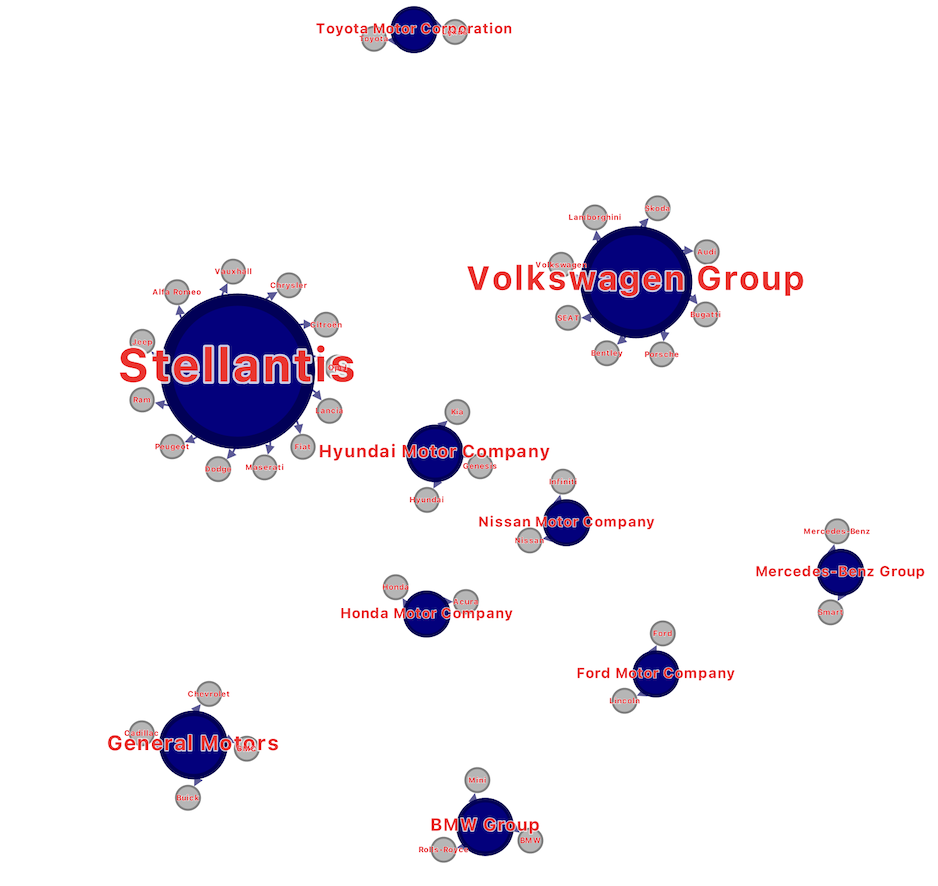

# 🚗 Car Brand Ownership Analysis

This project analyzes the ownership structure of global automotive companies using network analysis and visualization techniques. Using Python, NetworkX, and Gephi, the project explores how major parent companies control multiple automotive brands and identifies the most influential companies within the network.

---

# 📊 Overview

The automotive industry consists of many brands owned by a smaller number of parent companies. This project builds a directed network graph to visualize and analyze ownership relationships between automotive parent companies and their brands.

The goal of this analysis is to understand the structure of the automotive industry and determine which companies hold the greatest influence within the network.

---

# ❓ Research Question

Which automotive parent companies are the most influential within the global car brand ownership network?

---

# 📁 Dataset

The dataset was manually compiled using publicly available automotive ownership information.

### Dataset Features:
- Parent company
- Automotive brand
- Ownership relationship

### Examples:
- Toyota → Lexus
- Volkswagen Group → Audi
- BMW Group → MINI

---

# 🧹 Data Processing

The dataset was cleaned and formatted using Python and Pandas before building the network graph.

Processing steps included:
- Removing duplicate entries
- Formatting parent-brand relationships
- Creating nodes and directed edges
- Exporting the network for Gephi visualization

---

# 🕸️ Network Structure

The network was built as a directed graph.

- Nodes represent automotive companies and brands
- Directed edges represent ownership relationships
- Parent companies act as central hubs connected to their brands

This structure allows the network to reveal which companies control the largest portions of the automotive industry.

---

# 📈 Analysis Performed

The project applied several network analysis techniques, including:

- Degree centrality
- Out-degree analysis
- Betweenness centrality
- Network visualization in Gephi

These metrics were used to measure influence and connectivity within the automotive ownership network.

---

# 🌐 Network Visualization

The network visualization was created using Gephi. Larger nodes represent more influential companies with greater ownership connections, while smaller nodes represent individual automotive brands.

---

# 🔍 Key Insights

The analysis revealed that a small number of parent companies dominate the automotive industry through ownership of multiple brands.

Key findings include:
- Large automotive groups act as central hubs within the network
- Companies such as Volkswagen Group, Stellantis, and Toyota control multiple globally recognized brands
- The automotive industry is highly consolidated through parent-brand ownership structures

---

# ⚠️ Limitations

This project has several limitations:
- Ownership structures may change over time
- The dataset may not include every global automotive brand
- The analysis focuses only on ownership relationships and does not include factors such as revenue, sales volume, or market share

---

# 🛠️ Tools Used

- Python
- Pandas
- NetworkX
- Gephi
- Matplotlib

---

# 📂 Files

- `network_analysis.ipynb` → Main analysis notebook
- `car_brands_parent_companies.csv` → Dataset used for analysis
- `car_company_parent_brand_network.gexf` → Gephi network file
- `network_visualization.png` → Final network visualization

---

# 🔗 Medium Article

Read the full analysis here:
https://medium.com/@SYChaudhry/visualizing-global-car-company-ownership-using-network-analysis-9c04c88944f5

---

# 👤 Author

Shazab Chaudhry  
Date: March 2026
